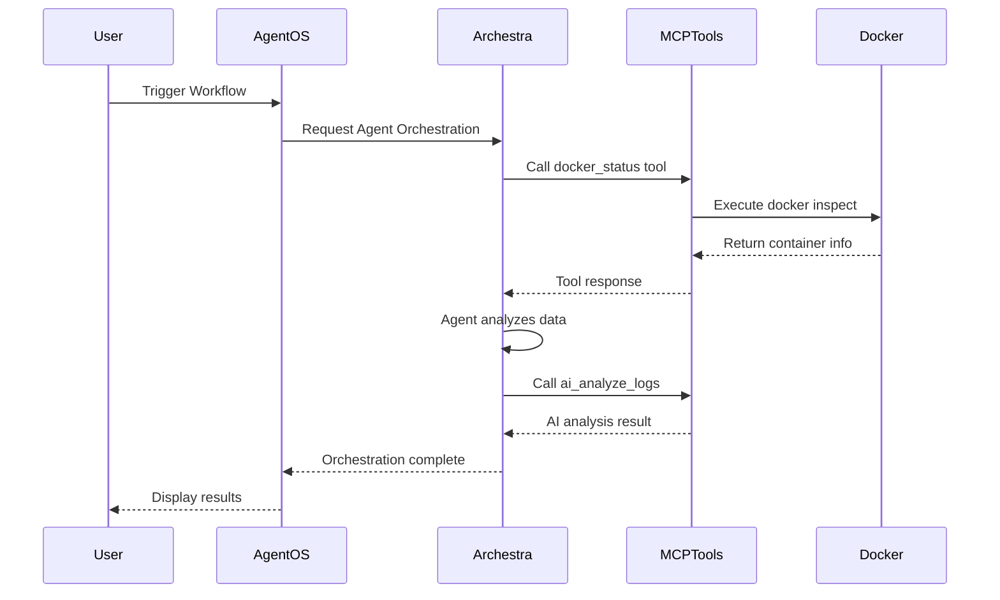
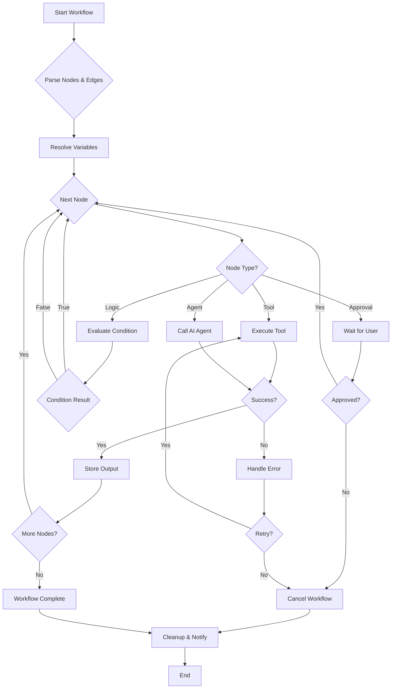
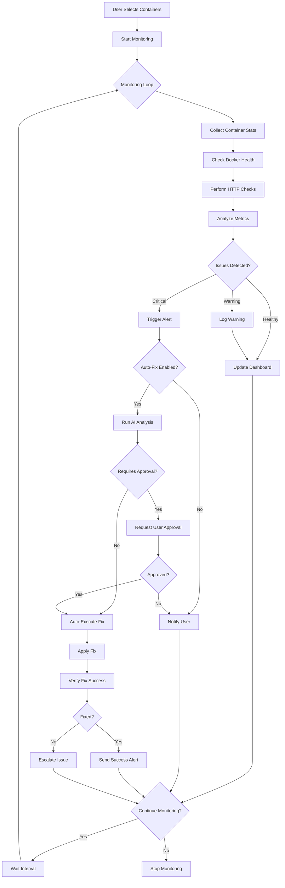
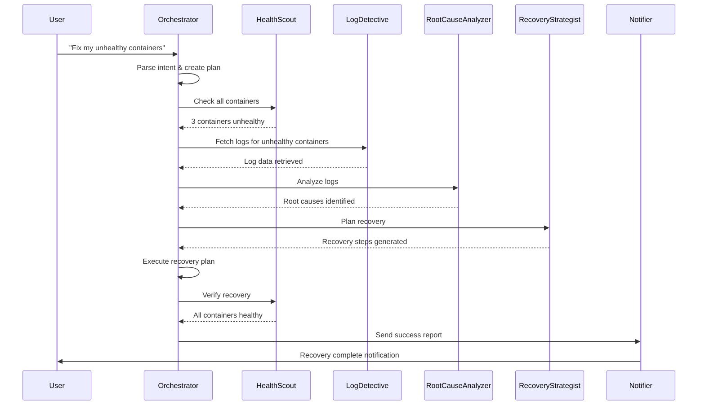

# 🚀 AgentOS - Intelligent Container Orchestration Platform

<div align="center">


[](LICENSE)
[](https://www.docker.com/)
[](https://nodejs.org/)

**AI-powered platform for automated container management, monitoring, and intelligent orchestration**

[Features](#-features) • [Architecture](#-architecture) • [Modes](#-operational-modes) • [Setup](#-getting-started) • [Documentation](#-documentation)

</div>

---

## 📋 Table of Contents

- [Overview](#-overview)
- [Features](#-features)
- [Architecture](#-architecture)
- [Archestra AI Integration](#-archestra-ai-integration)
- [Operational Modes](#-operational-modes)
  - [Runbook Mode](#1-runbook-mode)
  - [Monitor Mode](#2-monitor-mode)
  - [Agent Swarm Mode](#3-agent-swarm-mode)
- [Tech Stack](#-tech-stack)
- [Getting Started](#-getting-started)
- [Configuration](#-configuration)
- [API Documentation](#-api-documentation)
- [Contributing](#-contributing)

---

## 🌟 Overview

**AgentOS** is a next-generation container orchestration platform that combines the power of AI-driven automation with intelligent monitoring and self-healing capabilities. Built for DevOps engineers and SRE teams, it provides three distinct operational modes to handle different automation scenarios.

### Key Capabilities

- **🤖 AI-Powered Automation**: Leverages Archestra AI for intelligent decision-making
- **📊 Real-time Monitoring**: Live container health tracking with actionable insights
- **🔧 Self-Healing**: Automated recovery with approval gates for critical actions
- **🎯 Visual Workflow Builder**: Drag-and-drop interface for complex automation
- **🔄 Agent Orchestration**: Multi-agent collaboration for complex tasks
- **🛡️ Safety First**: Approval workflows for destructive operations

---

## ✨ Features

### Core Features

- ✅ **Visual Workflow Designer** - Drag-and-drop nodes to build automation workflows
- ✅ **Real-time Container Monitoring** - Track CPU, memory, network, disk metrics
- ✅ **AI Log Analysis** - Intelligent root cause analysis using Groq LLM
- ✅ **Auto-Healing** - Automated container recovery with safety gates
- ✅ **Multi-Agent Collaboration** - Coordinate multiple AI agents for complex tasks
- ✅ **Slack Integration** - Send notifications and alerts to Slack channels
- ✅ **Docker Operations** - Start, stop, restart, rollback containers
- ✅ **HTTP Health Checks** - Monitor application-level health
- ✅ **Approval Workflows** - Human-in-the-loop for critical actions

### Advanced Features

- 🔐 **Role-based Access Control** - Secure multi-user support
- 📈 **Historical Metrics** - Track performance over time
- 🔍 **Log Aggregation** - Centralized container log viewing
- 🎨 **Dark Mode** - Easy on the eyes for long monitoring sessions
- 📱 **Responsive Design** - Works on desktop, tablet, and mobile
- 🔄 **Live Updates** - WebSocket-based real-time communication

---

## 🏗️ Architecture

### High-Level System Architecture

```
┌─────────────────────────────────────────────────────────────────┐
│                         AgentOS Platform                        │
├─────────────────────────────────────────────────────────────────┤
│                                                                 │
│  ┌──────────────┐  ┌──────────────┐  ┌──────────────┐        │
│  │   Runbook    │  │   Monitor    │  │ Agent Swarm  │        │
│  │     Mode     │  │     Mode     │  │     Mode     │        │
│  └──────┬───────┘  └──────┬───────┘  └──────┬───────┘        │
│         │                 │                  │                 │
│         └─────────────────┼──────────────────┘                 │
│                           │                                     │
│  ┌────────────────────────┴─────────────────────────┐         │
│  │           Workflow Execution Engine               │         │
│  │  - Node Processing                                │         │
│  │  - Variable Resolution                            │         │
│  │  - Approval Management                            │         │
│  └────────────────────┬──────────────────────────────┘         │
│                       │                                         │
│  ┌────────────────────┴─────────────────────────────┐         │
│  │              MCP Tool Registry                    │         │
│  │  - Docker Tools                                   │         │
│  │  - Health Check Tools                             │         │
│  │  - AI Analyzer                                    │         │
│  │  - Slack Integration                              │         │
│  └────────────────────┬──────────────────────────────┘         │
│                       │                                         │
└───────────────────────┼─────────────────────────────────────────┘
                        │
        ┌───────────────┴───────────────┐
        │                               │
   ┌────┴─────┐                  ┌─────┴──────┐
   │ Docker   │                  │ Archestra  │
   │  Engine  │                  │     AI     │
   └──────────┘                  └────────────┘
```

### Component Breakdown

#### Frontend Layer
```
┌─────────────────────────────────────────────────────────┐
│                    Frontend (Next.js)                   │
├─────────────────────────────────────────────────────────┤
│                                                         │
│  ┌──────────────────┐  ┌──────────────────┐          │
│  │   React Flow     │  │   Socket.IO      │          │
│  │   Workflow UI    │  │   Client         │          │
│  └──────────────────┘  └──────────────────┘          │
│                                                         │
│  ┌──────────────────┐  ┌──────────────────┐          │
│  │  Monitor         │  │  Agent Swarm     │          │
│  │  Dashboard       │  │  Interface       │          │
│  └──────────────────┘  └──────────────────┘          │
│                                                         │
└─────────────────────────────────────────────────────────┘
```

#### Backend Layer
```
┌─────────────────────────────────────────────────────────┐
│                  Backend (Node.js/Express)              │
├─────────────────────────────────────────────────────────┤
│                                                         │
│  ┌──────────────────────────────────────────────┐     │
│  │         REST API Layer                       │     │
│  │  /api/workflows  /api/runs  /api/monitor    │     │
│  └──────────────────┬───────────────────────────┘     │
│                     │                                   │
│  ┌──────────────────┴───────────────────────────┐     │
│  │         Workflow Execution Engine            │     │
│  │  - Node Executor                             │     │
│  │  - Approval Manager                          │     │
│  │  - Variable Resolver                         │     │
│  └──────────────────┬───────────────────────────┘     │
│                     │                                   │
│  ┌──────────────────┴───────────────────────────┐     │
│  │              Tool Registry                   │     │
│  │  - MCP Client                                │     │
│  │  - Docker Tools                              │     │
│  │  - AI Analyzer                               │     │
│  └──────────────────────────────────────────────┘     │
│                                                         │
└─────────────────────────────────────────────────────────┘
```

---

## 🤖 Archestra AI Integration

AgentOS integrates with **Archestra AI** to enable intelligent agent orchestration and advanced automation capabilities.

### Archestra Components Used

```
┌─────────────────────────────────────────────────────────┐
│                    Archestra AI Platform                │
├─────────────────────────────────────────────────────────┤
│                                                         │
│  ┌────────────────────────────────────────┐           │
│  │         Agent Orchestration            │           │
│  │  ┌──────────────────────────────────┐  │           │
│  │  │  • DevOps Orchestrator           │  │           │
│  │  │  • Root Cause Analyzer           │  │           │
│  │  │  • Health Scout                  │  │           │
│  │  │  • Log Detective                 │  │           │
│  │  │  • Recovery Strategist           │  │           │
│  │  │  • Notifier                      │  │           │
│  │  └──────────────────────────────────┘  │           │
│  └────────────────────────────────────────┘           │
│                                                         │
│  ┌────────────────────────────────────────┐           │
│  │         MCP Tools Gateway              │           │
│  │  ┌──────────────────────────────────┐  │           │
│  │  │  • Docker Management Tools       │  │           │
│  │  │  • Health Check Tools            │  │           │
│  │  │  • Monitoring Tools              │  │           │
│  │  │  • Notification Tools            │  │           │
│  │  │  • AI Analysis Tools             │  │           │
│  │  └──────────────────────────────────┘  │           │
│  └────────────────────────────────────────┘           │
│                                                         │
└─────────────────────────────────────────────────────────┘
```

### Agent Architecture

#### DevOps Orchestrator Agent
**Role**: Master coordinator for DevOps workflows
- Delegates tasks to specialized agents
- Manages workflow execution
- Coordinates multi-step operations
- Makes high-level decisions

#### Root Cause Analyzer Agent
**Role**: Intelligent log analysis and problem diagnosis
- Analyzes container logs
- Identifies error patterns
- Determines root causes
- Provides confidence scores

#### Health Scout Agent
**Role**: Comprehensive health monitoring
- Checks Docker container health
- Performs HTTP health checks
- Validates application status
- Reports health metrics

#### Log Detective Agent
**Role**: Deep log investigation
- Fetches and parses logs
- Extracts error patterns
- Correlates events
- Identifies anomalies

#### Recovery Strategist Agent
**Role**: Automated recovery planning
- Evaluates recovery options
- Plans safe restart procedures
- Implements rollback strategies
- Validates recovery success

#### Notifier Agent
**Role**: Communication and alerting
- Sends Slack notifications
- Formats alert messages
- Manages notification channels
- Tracks notification history

### MCP Protocol Integration

```
┌─────────────────────────────────────────────────────────┐
│              MCP (Model Context Protocol)               │
├─────────────────────────────────────────────────────────┤
│                                                         │
│  AgentOS ←→ Archestra Gateway ←→ MCP Tools            │
│                                                         │
│  ┌─────────────┐    ┌─────────────┐    ┌───────────┐ │
│  │   AgentOS   │───▶│  Archestra  │───▶│    MCP    │ │
│  │   Client    │◀───│   Gateway   │◀───│   Server  │ │
│  └─────────────┘    └─────────────┘    └───────────┘ │
│                                                         │
│  Features:                                             │
│  • Secure communication                                │
│  • Tool discovery                                      │
│  • Streaming responses                                 │
│  • Error handling                                      │
│                                                         │
└─────────────────────────────────────────────────────────┘
```

### Integration Flow



---

## 🎯 Operational Modes

AgentOS provides three distinct modes for different automation scenarios:

### Mode Comparison

| Feature | Runbook Mode | Monitor Mode | Agent Swarm Mode |
|---------|--------------|--------------|------------------|
| **Purpose** | Custom workflows | Live monitoring | AI orchestration |
| **User Control** | High | Medium | Low |
| **Automation Level** | Manual trigger | Auto-detect | Fully autonomous |
| **AI Integration** | Optional | Built-in | Core feature |
| **Use Case** | Complex tasks | Health tracking | Self-healing |
| **Best For** | DevOps teams | SRE teams | Production systems |

---

### 1. Runbook Mode

**Automated workflow execution with visual builder**

#### Overview
Runbook Mode allows users to design custom automation workflows using a visual drag-and-drop interface powered by React Flow. Perfect for creating reusable operational procedures.

#### Architecture

```
┌────────────────────────────────────────────────────────┐
│                    Runbook Mode                        │
├────────────────────────────────────────────────────────┤
│                                                        │
│  ┌──────────────────────────────────────────────┐    │
│  │          Visual Workflow Builder             │    │
│  │  ┌────────────────────────────────────────┐  │    │
│  │  │  Node Palette:                         │  │    │
│  │  │  • Start/End Nodes                     │  │    │
│  │  │  • Docker Tools                        │  │    │
│  │  │  • Health Checks                       │  │    │
│  │  │  • AI Analyzer                         │  │    │
│  │  │  • Slack Notifications                 │  │    │
│  │  │  • Logic Gates (If/Else)               │  │    │
│  │  │  • Loops & Delays                      │  │    │
│  │  │  • Approval Gates                      │  │    │
│  │  └────────────────────────────────────────┘  │    │
│  └──────────────────────────────────────────────┘    │
│                         │                             │
│  ┌──────────────────────▼──────────────────────┐    │
│  │         Workflow Execution Engine           │    │
│  │  ┌────────────────────────────────────────┐ │    │
│  │  │  1. Parse workflow definition          │ │    │
│  │  │  2. Resolve variables & templates      │ │    │
│  │  │  3. Execute nodes sequentially         │ │    │
│  │  │  4. Handle approvals & gates           │ │    │
│  │  │  5. Emit progress events               │ │    │
│  │  │  6. Handle errors & rollbacks          │ │    │
│  │  └────────────────────────────────────────┘ │    │
│  └──────────────────────────────────────────────┘    │
│                                                        │
└────────────────────────────────────────────────────────┘
```

#### Workflow Execution Flow



#### Key Features

**Visual Builder**
- Drag-and-drop interface
- Real-time validation
- Auto-layout
- Node search & filtering
- Template library

**Node Types**

1. **Input Nodes**
   - Manual Input
   - File Upload
   - API Trigger
   - Schedule Trigger

2. **Action Nodes**
   - Docker Operations
   - HTTP Requests
   - File Operations
   - Database Queries

3. **Logic Nodes**
   - If/Else Conditions
   - Switch/Case
   - For Each Loop
   - Delay/Wait

4. **Integration Nodes**
   - Slack Notifications
   - Email Sender
   - Webhook Call
   - API Integration

5. **AI Nodes**
   - Log Analyzer
   - Decision Maker
   - Text Generator
   - Pattern Detector

**Variable System**
```typescript
// Variables can be used throughout workflows
{{previousNode.output.containerName}}
{{vars.healthUrl}}
{{input.userChoice}}
```

#### Example Workflows

**1. Container Health Check & Restart**
```
Start → List Containers → For Each Container
  ├─ Check Health → If Unhealthy
  │   ├─ Fetch Logs → AI Analyze
  │   │   └─ Approval Gate → Restart Container
  │   │       └─ Verify Health → Slack Notify
  │   └─ If Healthy → Continue
  └─ End
```

**2. Automated Deployment**
```
Start → Pull Latest Image → Stop Old Container
  → Remove Old Container → Start New Container
  → Health Check → If Failed
      ├─ Rollback to Previous → Notify Failure
      └─ If Success → Update Load Balancer → Notify Success
```

#### Usage

```typescript
// Create a workflow
const workflow = {
  name: "Auto Recovery",
  nodes: [
    { id: "1", type: "start" },
    { id: "2", type: "tool.dockerStatus", config: { containerName: "{{input.container}}" }},
    { id: "3", type: "logic.ifelse", config: { condition: "{{node2.healthy}} === false" }},
    { id: "4", type: "tool.dockerRestart", config: { containerName: "{{input.container}}" }},
    { id: "5", type: "tool.slackNotify", config: { message: "Container restarted" }},
    { id: "6", type: "end" }
  ],
  edges: [
    { from: "1", to: "2" },
    { from: "2", to: "3" },
    { from: "3", to: "4", condition: "true" },
    { from: "3", to: "6", condition: "false" },
    { from: "4", to: "5" },
    { from: "5", to: "6" }
  ]
};

// Execute workflow
await executeWorkflow(workflow, { container: "nginx" });
```

---

### 2. Monitor Mode

**Real-time container monitoring with AI-powered insights**

#### Overview
Monitor Mode provides continuous health tracking of Docker containers with automated alerting, AI-powered log analysis, and self-healing capabilities.

#### Architecture

```
┌────────────────────────────────────────────────────────┐
│                    Monitor Mode                        │
├────────────────────────────────────────────────────────┤
│                                                        │
│  ┌──────────────────────────────────────────────┐    │
│  │      Container Selection Interface           │    │
│  │  • Search & filter containers                │    │
│  │  • Select specific containers                │    │
│  │  • Configure monitoring interval             │    │
│  │  • Set alert thresholds                      │    │
│  └────────────────┬─────────────────────────────┘    │
│                   │                                    │
│  ┌────────────────▼─────────────────────────────┐    │
│  │       Continuous Monitoring Engine           │    │
│  │  ┌────────────────────────────────────────┐  │    │
│  │  │  Every N seconds:                      │  │    │
│  │  │  1. Fetch container stats              │  │    │
│  │  │  2. Check Docker health                │  │    │
│  │  │  3. Perform HTTP health checks         │  │    │
│  │  │  4. Analyze resource usage             │  │    │
│  │  │  5. Detect anomalies                   │  │    │
│  │  │  6. Emit metrics via WebSocket         │  │    │
│  │  └────────────────────────────────────────┘  │    │
│  └────────────────┬─────────────────────────────┘    │
│                   │                                    │
│  ┌────────────────▼─────────────────────────────┐    │
│  │         Live Metrics Dashboard               │    │
│  │  ┌────────────────────────────────────────┐  │    │
│  │  │  Real-time Metrics:                    │  │    │
│  │  │  • CPU Usage %                         │  │    │
│  │  │  • Memory Usage / Limit                │  │    │
│  │  │  • Network In/Out                      │  │    │
│  │  │  • Disk Read/Write                     │  │    │
│  │  │  • Uptime                              │  │    │
│  │  │  • Restart Count                       │  │    │
│  │  │  • HTTP Health Status                  │  │    │
│  │  └────────────────────────────────────────┘  │    │
│  └──────────────────────────────────────────────┘    │
│                                                        │
└────────────────────────────────────────────────────────┘
```

#### Monitoring Flow



#### Metrics Collection

```typescript
// Per-container metrics collected every interval
interface ContainerMetrics {
  // Identification
  containerName: string;
  containerId: string;
  image: string;
  
  // Health Status
  dockerHealthy: boolean;
  applicationHealthy: boolean;
  severity: "HEALTHY" | "WARNING" | "CRITICAL";
  
  // Resource Usage
  cpuPercent: string;          // "45.2%"
  memPercent: string;          // "62.1%"
  memUsage: string;            // "1.2GB"
  memLimit: string;            // "2GB"
  
  // Network
  networkIn: string;           // "125MB"
  networkOut: string;          // "89MB"
  
  // Disk I/O
  diskRead: string;            // "45MB"
  diskWrite: string;           // "23MB"
  
  // Runtime Info
  uptime: string;              // "2d 5h 32m"
  restartCount: number;        // 3
  
  // HTTP Health
  httpHealthStatus?: {
    checked: boolean;
    healthy: boolean;
    statusCode?: number;
    responseTime?: number;
    checkedUrl?: string;
  };
  
  // Issues
  issues?: string[];
  
  // Logs
  logs?: string;
  
  // Timestamp
  timestamp: string;
}
```

#### Alert System

**Alert Types**
1. **Critical Alerts**
   - Container stopped
   - Application health check failed
   - Memory exhaustion (>95%)
   - CPU spike (>90% for 5 minutes)
   - Excessive restarts (>5 in 10 minutes)

2. **Warning Alerts**
   - High resource usage (>80%)
   - Slow response times (>2s)
   - Error patterns in logs
   - Container instability

3. **Info Alerts**
   - Container recovered
   - Successful restart
   - Health check passed after failure

**Alert Flow**
```
Detect Issue → Classify Severity → Generate Alert
  → Send Notification (Slack/Email)
  → If Critical + Auto-Fix → AI Analysis
  → Suggest Fix → Approval Gate → Execute
```

#### AI-Powered Features

**1. Log Analysis**
```typescript
// Triggered on container failure
const analysis = await analyzeContainerLogs({
  containerName: "nginx",
  logs: containerLogs,
  context: "Container became unhealthy"
});

// Returns:
{
  summary: "Nginx failed to bind to port 80",
  rootCause: "Port already in use by another process",
  errorCategory: "configuration_error",
  confidence: "high",
  suggestedFixes: [
    "Change nginx port in config",
    "Stop conflicting process on port 80",
    "Use different host port mapping"
  ]
}
```

**2. Auto-Healing**
```typescript
// Automatic recovery workflow
if (container.severity === "CRITICAL" && autoFixEnabled) {
  // AI determines best recovery strategy
  const strategy = await getRecoveryStrategy(container);
  
  if (strategy.requiresApproval) {
    await requestUserApproval(strategy);
  }
  
  await executeRecovery(strategy);
  await verifyRecovery(container);
}
```

#### Dashboard Features

**Main Dashboard**
- Real-time metric cards
- Status overview (Healthy/Warning/Critical counts)
- Container filtering and search
- Alert timeline
- Quick actions (Restart, Analyze, Notify)

**Container Detail View**
- Comprehensive metrics
- Live log streaming
- Historical trends
- Resource graphs
- Action buttons

**Alert Panel**
- Recent alerts list
- Alert severity indicators
- Acknowledgment tracking
- Alert history

#### Usage

```typescript
// Start monitoring specific containers
await startMonitoring({
  sessionId: "unique-session-id",
  config: {
    selectedContainers: ["nginx", "postgres", "redis"],
    interval: 30, // seconds
    autoFix: true,
    alertOnChange: true
  }
});

// Monitor emits events via WebSocket
socket.on("monitor-check-completed", (data) => {
  updateDashboard(data.containers);
});

socket.on("monitor-alert", (alert) => {
  showNotification(alert);
});
```

---

### 3. Agent Swarm Mode

**Multi-agent AI orchestration for autonomous operations**

#### Overview
Agent Swarm Mode leverages Archestra AI's multi-agent system for complex, autonomous DevOps operations where multiple specialized AI agents collaborate to solve problems.

#### Architecture

```
┌────────────────────────────────────────────────────────┐
│                  Agent Swarm Mode                      │
├────────────────────────────────────────────────────────┤
│                                                        │
│  ┌──────────────────────────────────────────────┐    │
│  │         User Intent Interface                │    │
│  │  • Natural language input                    │    │
│  │  • Predefined scenarios                      │    │
│  │  • Priority selection                        │    │
│  │  • Context provision                         │    │
│  └────────────────┬─────────────────────────────┘    │
│                   │                                    │
│  ┌────────────────▼─────────────────────────────┐    │
│  │     DevOps Orchestrator (Master Agent)       │    │
│  │  • Understands user intent                   │    │
│  │  • Creates execution plan                    │    │
│  │  • Delegates to specialized agents           │    │
│  │  • Coordinates agent collaboration           │    │
│  │  • Monitors progress                         │    │
│  │  • Handles failures                          │    │
│  └────────────────┬─────────────────────────────┘    │
│                   │                                    │
│         ┌─────────┴─────────┐                         │
│         │                   │                         │
│  ┌──────▼──────┐    ┌──────▼──────┐                 │
│  │Root Cause   │    │Health Scout │                 │
│  │Analyzer     │    │             │                 │
│  └──────┬──────┘    └──────┬──────┘                 │
│         │                   │                         │
│  ┌──────▼──────┐    ┌──────▼──────┐                 │
│  │Log          │    │Recovery     │                 │
│  │Detective    │    │Strategist   │                 │
│  └──────┬──────┘    └──────┬──────┘                 │
│         │                   │                         │
│         └─────────┬─────────┘                         │
│                   │                                    │
│  ┌────────────────▼─────────────────────────────┐    │
│  │              Notifier Agent                  │    │
│  │  • Formats results                           │    │
│  │  • Sends notifications                       │    │
│  │  • Provides status updates                   │    │
│  └──────────────────────────────────────────────┘    │
│                                                        │
└────────────────────────────────────────────────────────┘
```

#### Agent Collaboration Flow



#### Agent Roles & Capabilities

**DevOps Orchestrator** (Master Agent)
```typescript
Capabilities:
- Intent understanding
- Plan generation
- Agent delegation
- Progress tracking
- Error handling
- Result aggregation

Example Tasks:
- "Fix all unhealthy containers"
- "Investigate high CPU usage"
- "Deploy new version safely"
- "Rollback recent changes"
```

**Root Cause Analyzer**
```typescript
Capabilities:
- Log pattern recognition
- Error correlation
- Root cause identification
- Confidence scoring

Input: Container logs, error messages
Output: Root cause analysis with confidence

Example:
{
  rootCause: "Database connection pool exhausted",
  errorCategory: "resource_exhaustion",
  confidence: "high",
  evidence: ["Connection timeout errors", "Pool size: 0/50"]
}
```

**Health Scout**
```typescript
Capabilities:
- Container health checking
- HTTP endpoint testing
- Resource usage monitoring
- Status reporting

Input: Container list
Output: Health report

Example:
{
  totalContainers: 10,
  healthy: 7,
  unhealthy: 3,
  details: [...]
}
```

**Log Detective**
```typescript
Capabilities:
- Log retrieval
- Log parsing
- Pattern extraction
- Anomaly detection

Input: Container names, time range
Output: Structured log data

Example:
{
  container: "nginx",
  errorCount: 45,
  patterns: ["502 Bad Gateway", "upstream timeout"],
  timeRange: "last 1 hour"
}
```

**Recovery Strategist**
```typescript
Capabilities:
- Recovery plan generation
- Risk assessment
- Rollback strategy
- Verification steps

Input: Problem analysis
Output: Recovery plan

Example:
{
  strategy: "restart_with_verification",
  steps: [
    "Stop container gracefully",
    "Clear temp files",
    "Start container",
    "Wait 30s",
    "Verify health"
  ],
  estimatedTime: "2 minutes",
  risk: "low"
}
```

**Notifier**
```typescript
Capabilities:
- Message formatting
- Multi-channel notification
- Status updates
- Report generation

Input: Results, metadata
Output: Formatted notifications

Example:
{
  channel: "slack",
  title: "Container Recovery Complete",
  summary: "3 containers recovered successfully",
  details: [...]
}
```

#### Example Scenarios

**Scenario 1: Emergency Response**
```
User: "All my services are down!"

Orchestrator Plan:
1. Health Scout: Identify all unhealthy containers
2. Log Detective: Fetch recent logs
3. Root Cause Analyzer: Find common cause
4. Recovery Strategist: Plan batch recovery
5. Execute recovery for all containers
6. Health Scout: Verify all recovered
7. Notifier: Send detailed report
```

**Scenario 2: Performance Investigation**
```
User: "Why is my app slow?"

Orchestrator Plan:
1. Health Scout: Check container resources
2. Log Detective: Fetch application logs
3. Root Cause Analyzer: Identify bottlenecks
4. Recovery Strategist: Suggest optimizations
5. Notifier: Provide performance report
```

**Scenario 3: Proactive Maintenance**
```
Scheduled Task: "Daily health check"

Orchestrator Plan:
1. Health Scout: Check all containers
2. Log Detective: Scan for warning patterns
3. Root Cause Analyzer: Identify potential issues
4. Recovery Strategist: Plan preventive actions
5. Notifier: Send daily health report
```

#### Configuration

```typescript
// Configure agent swarm
const swarmConfig = {
  // Master orchestrator settings
  orchestrator: {
    model: "claude-sonnet-4",
    temperature: 0.3,
    maxRetries: 3
  },
  
  // Specialized agents
  agents: {
    rootCauseAnalyzer: { enabled: true },
    healthScout: { enabled: true },
    logDetective: { enabled: true },
    recoveryStrategist: { enabled: true },
    notifier: { enabled: true }
  },
  
  // Collaboration rules
  collaboration: {
    maxParallelAgents: 3,
    timeoutPerAgent: 30000, // ms
    retryFailedAgents: true
  }
};
```

#### Usage

```typescript
// Trigger agent swarm with natural language
const result = await triggerAgentSwarm({
  intent: "Fix all unhealthy containers and send me a report",
  context: {
    environment: "production",
    priority: "high",
    requireApproval: true
  }
});

// Orchestrator handles the rest automatically
// Results arrive via WebSocket:
socket.on("agent-progress", (update) => {
  console.log(`${update.agent}: ${update.message}`);
});

socket.on("agent-complete", (result) => {
  console.log("Final result:", result);
});
```

---

## 🛠️ Tech Stack

### Frontend
- **Framework**: Next.js 14 (App Router)
- **UI Library**: React 18
- **Styling**: Tailwind CSS
- **Workflow Visualization**: React Flow
- **Animations**: Framer Motion
- **Icons**: Lucide React
- **State Management**: React Hooks
- **Real-time**: Socket.IO Client

### Backend
- **Runtime**: Node.js 18+
- **Framework**: Express.js
- **Database**: MongoDB
- **Real-time**: Socket.IO Server
- **Docker SDK**: Dockerode
- **AI Integration**: Groq SDK
- **MCP Client**: @modelcontextprotocol/sdk

### Infrastructure
- **Containerization**: Docker
- **AI Platform**: Archestra AI
- **LLM**: Claude Sonnet 4 (via Archestra)
- **Monitoring**: Custom WebSocket-based system

### Development Tools
- **Language**: TypeScript
- **Package Manager**: npm
- **Linting**: ESLint
- **Formatting**: Prettier
- **Version Control**: Git

---

## 🚀 Getting Started

### Prerequisites

```bash
# Required
- Node.js 18+ (LTS recommended)
- Docker Desktop (running)
- MongoDB 6.0+

# Optional
- Archestra AI account (for agent swarm mode)
- Groq API key (for AI analysis)
- Slack webhook (for notifications)
```

### Installation

#### 1. Clone Repository

```bash
git clone https://github.com/yourusername/agentos.git
cd agentos
```

#### 2. Backend Setup

```bash
cd backend
npm install

# Create environment file
cp .env.example .env

# Configure environment variables
nano .env
```

**Backend Environment Variables:**
```env
# Server
PORT=5000
NODE_ENV=development

# Database
MONGODB_URI=mongodb://localhost:27017/agentos

# Frontend URL
FRONTEND_URL=http://localhost:3000

# Archestra AI (for agent swarm)
ARCHESTRA_PROXY_URL=http://localhost:9000
ARCHESTRA_AUTH_TOKEN=your_token_here
ARCHESTRA_MCP_TOKEN=your_mcp_token_here
GATEWAY_ID=your_gateway_id

# AI Services
GROQ_API_KEY=your_groq_api_key_here

# Slack Integration (optional)
SLACK_WEBHOOK_URL=https://hooks.slack.com/services/YOUR/WEBHOOK/URL

# Docker Configuration
DOCKER_HOST=unix:///var/run/docker.sock
# For remote Docker:
# DOCKER_HOST=tcp://remote-host:2375
```

**Start Backend:**
```bash
npm run dev
```

#### 3. Frontend Setup

```bash
cd frontend
npm install

# Create environment file
cp .env.local.example .env.local

# Configure environment variables
nano .env.local
```

**Frontend Environment Variables:**
```env
NEXT_PUBLIC_API_URL=http://localhost:5000
```

**Start Frontend:**
```bash
npm run dev
```

### Access Application

- **Frontend**: http://localhost:3000
- **Backend API**: http://localhost:5000
- **API Health**: http://localhost:5000/health

---

## ⚙️ Configuration

### Docker Connection

**Local Docker:**
```env
DOCKER_HOST=unix:///var/run/docker.sock
```

**Remote Docker:**
```env
DOCKER_HOST=tcp://192.168.1.100:2375
DOCKER_CERT_PATH=/path/to/certs (if using TLS)
```

### Monitoring Configuration

```typescript
// Default monitoring settings
{
  interval: 30,              // Check every 30 seconds
  autoFix: true,             // Enable auto-healing
  alertOnChange: true,       // Alert on status changes
  containerFilters: "",      // Filter containers (optional)
  selectedContainers: []     // Specific containers to monitor
}
```

### Archestra Configuration

```typescript
// Agent swarm configuration
{
  orchestrator: {
    model: "claude-sonnet-4",
    temperature: 0.3,
    maxRetries: 3
  },
  agents: {
    rootCauseAnalyzer: true,
    healthScout: true,
    logDetective: true,
    recoveryStrategist: true,
    notifier: true
  }
}
```

---

## 📡 API Documentation

### Workflow API

**Create Workflow**
```http
POST /api/workflows
Content-Type: application/json

{
  "name": "Auto Recovery Workflow",
  "nodes": [...],
  "edges": [...]
}
```

**Execute Workflow**
```http
POST /api/runs
Content-Type: application/json

{
  "workflowId": "workflow_id",
  "inputs": {
    "containerName": "nginx"
  }
}
```

### Monitor API

**List Containers**
```http
GET /api/monitor/containers
```

**Start Monitoring**
```http
POST /api/monitor/start
Content-Type: application/json

{
  "sessionId": "unique-session-id",
  "config": {
    "selectedContainers": ["nginx", "postgres"],
    "interval": 30,
    "autoFix": true
  }
}
```

**Stop Monitoring**
```http
POST /api/monitor/stop
Content-Type: application/json

{
  "sessionId": "unique-session-id"
}
```

### Agent Swarm API

**Trigger Agent Swarm**
```http
POST /api/agent-swarm/trigger
Content-Type: application/json

{
  "intent": "Fix unhealthy containers",
  "context": {
    "environment": "production",
    "priority": "high"
  }
}
```

---

## 🤝 Contributing

We welcome contributions! Please see [CONTRIBUTING.md](CONTRIBUTING.md) for details.

### Development Workflow

1. Fork the repository
2. Create a feature branch (`git checkout -b feature/amazing-feature`)
3. Commit your changes (`git commit -m 'Add amazing feature'`)
4. Push to the branch (`git push origin feature/amazing-feature`)
5. Open a Pull Request

### Code Style

- Use TypeScript for all new code
- Follow ESLint configuration
- Write meaningful commit messages
- Add tests for new features
- Update documentation

---

## 📄 License

This project is licensed under the MIT License - see the [LICENSE](LICENSE) file for details.

---

## 🙏 Acknowledgments

- **Archestra AI** for agent orchestration platform
- **Docker** for containerization technology
- **Anthropic** for Claude AI models
- **Groq** for fast LLM inference
- **React Flow** for workflow visualization
- **Socket.IO** for real-time communication

---

## 📞 Support

- **Documentation**: [docs.agentos.io](https://docs.agentos.io)
- **Issues**: [GitHub Issues](https://github.com/yourusername/agentos/issues)
- **Discussions**: [GitHub Discussions](https://github.com/yourusername/agentos/discussions)
- **Email**: support@agentos.io

---

## 🗺️ Roadmap

### Coming Soon
- [ ] Kubernetes support
- [ ] Custom agent creation
- [ ] Historical metrics & trends
- [ ] Multi-cloud support
- [ ] Advanced alerting rules
- [ ] Workflow marketplace
- [ ] Mobile app

### In Progress
- [x] Container selection UI
- [x] Real-time monitoring
- [x] AI log analysis
- [x] Agent swarm mode
- [x] Approval workflows

---

<div align="center">

**Built with ❤️ by the AgentOS Team**

[Website](https://agentos.io) • [Documentation](https://docs.agentos.io) • [Blog](https://blog.agentos.io)

</div>
