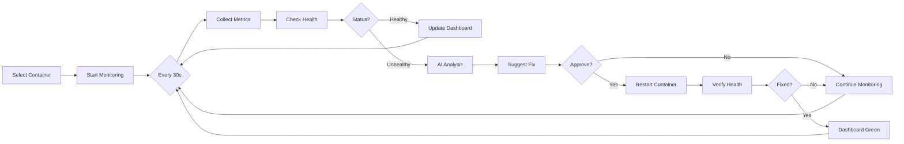

# 🚀 AgentOS - AI-Powered DevOps Automation Platform

<div align="center">


[](https://www.docker.com/)
[](https://nodejs.org/)

**Intelligent container management with AI agent orchestration and automated workflows**

[Features](#-features) • [Architecture](#-architecture) • [Modes](#-operational-modes) • [Quick Start](#-quick-start)

</div>

---

## 🌟 Overview

**AgentOS** combines AI-driven automation with intelligent monitoring for self-healing container orchestration. Built for DevOps engineers, it provides three operational modes: visual workflow builder, real-time monitoring, and autonomous AI agent swarms.

### Core Capabilities

- **🤖 AI Agent Orchestration**: Archestra AI coordinates specialized agents for complex operations
- **📊 Real-time Monitoring**: Live container health tracking with auto-detection
- **🔧 Self-Healing**: Automated recovery with approval gates
- **🎯 Visual Workflows**: Drag-and-drop runbook builder
- **🔄 Multi-Agent Collaboration**: DevOps Orchestrator, Root Cause Analyzer, Health Scout, Log Detective, Recovery Strategist, Notifier

---

## ✨ Key Features

✅ **Visual Runbook Builder** - Drag & drop nodes to create automation workflows  
✅ **Live Container Monitoring** - Track CPU, memory, network, disk metrics in real-time  
✅ **AI Log Analysis** - Intelligent root cause detection using Groq LLM  
✅ **Auto-Healing Workflows** - Automated recovery with approval gates  
✅ **Agent Swarm Mode** - Multi-agent AI collaboration for complex incidents  
✅ **Slack Integration** - Real-time alerts and notifications  
✅ **Docker Operations** - Start, stop, restart, inspect containers  
✅ **HTTP Health Checks** - Application-level health verification  

---

## 🏗️ Architecture

### System Overview

```
┌─────────────────────────────────────────────────────────┐
│                     AgentOS Platform                    │
├─────────────────────────────────────────────────────────┤
│                                                         │
│  ┌──────────┐  ┌──────────┐  ┌──────────────┐        │
│  │ Runbook  │  │ Monitor  │  │ Agent Swarm  │        │
│  │   Mode   │  │   Mode   │  │     Mode     │        │
│  └────┬─────┘  └────┬─────┘  └──────┬───────┘        │
│       │             │                │                 │
│       └─────────────┼────────────────┘                 │
│                     │                                   │
│  ┌──────────────────▼────────────────────────┐        │
│  │      Workflow Execution Engine             │        │
│  │  • Node Processing                         │        │
│  │  • Variable Resolution                     │        │
│  │  • Approval Management                     │        │
│  └──────────────────┬────────────────────────┘        │
│                     │                                   │
│  ┌──────────────────▼────────────────────────┐        │
│  │         MCP Tool Registry                  │        │
│  │  • Docker Tools                            │        │
│  │  • Health Checks                           │        │
│  │  • AI Analyzer                             │        │
│  │  • Slack Notifier                          │        │
│  └──────────────────┬────────────────────────┘        │
│                     │                                   │
└─────────────────────┼─────────────────────────────────┘
                      │
        ┌─────────────┴────────────┐
        │                          │
   ┌────▼─────┐            ┌──────▼────┐
   │  Docker  │            │ Archestra │
   │  Engine  │            │    AI     │
   └──────────┘            └───────────┘
```

### Archestra AI Agent Architecture

```
┌─────────────────────────────────────────────────────┐
│              Archestra AI Platform                  │
├─────────────────────────────────────────────────────┤
│                                                     │
│  ┌─────────────────────────────────────────────┐  │
│  │       DevOps Orchestrator (Master)          │  │
│  │  Coordinates all agents and workflow        │  │
│  └──────────────┬──────────────────────────────┘  │
│                 │                                   │
│     ┌───────────┼───────────┐                     │
│     │           │           │                     │
│  ┌──▼──┐    ┌──▼──┐    ┌──▼──┐                  │
│  │Root │    │Health│    │ Log │                  │
│  │Cause│    │Scout│    │Det. │                  │
│  └──┬──┘    └──┬──┘    └──┬──┘                  │
│     │           │           │                     │
│     └───────────┼───────────┘                     │
│                 │                                   │
│  ┌──────────────▼──────────────────────────────┐  │
│  │         Recovery Strategist                 │  │
│  └──────────────┬──────────────────────────────┘  │
│                 │                                   │
│  ┌──────────────▼──────────────────────────────┐  │
│  │             Notifier                        │  │
│  └─────────────────────────────────────────────┘  │
│                                                     │
└─────────────────────────────────────────────────────┘
```

**Hybrid Execution Model:**
- **Agent Mode**: Archestra orchestrates multi-agent collaboration for investigations
- **Runbook/Monitor Mode**: Direct MCP tool calls for deterministic operations

---

## 🎯 Operational Modes

### Mode Comparison

| Feature | Runbook Mode | Monitor Mode | Agent Swarm Mode |
|---------|--------------|--------------|------------------|
| **Control** | Manual | Semi-Auto | Autonomous |
| **AI Usage** | Optional | Built-in | Core |
| **Use Case** | Custom workflows | Live monitoring | Self-healing |
| **Trigger** | Manual | Auto-detect | Natural language |

---

### 1️⃣ Runbook Mode - Visual Workflow Builder

**Drag-and-drop automation workflows with MCP tools**

#### Features
- Visual workflow designer powered by React Flow
- Pre-built node library (Docker, Health Checks, AI Analysis, Slack)
- Logic nodes (If/Else, Loops, Delays)
- Approval gates for critical actions
- Live execution logs with timeline view
- Variable templating system
- AI-generated workflow suggestions

#### Example Workflow: Auto-Recovery

```
START
  ↓
[1] Health Check Scanner (scan all containers)
  ↓
[2] If Unhealthy? (condition check)
  ↓ YES
[3] Docker Status (get container details)
  ↓
[4] Docker Logs (fetch last 100 lines)
  ↓
[5] AI Log Analyzer (identify root cause)
  ↓
[6] Approval Gate (require manual approval)
  ↓ APPROVED
[7] Docker Restart (attempt recovery)
  ↓
[8] Wait 10 seconds (allow startup)
  ↓
[9] Health Check Verification (confirm fix)
  ↓
[10] Slack Notify (send status report)
  ↓
END
```

#### Available Node Types

**Tool Nodes** (Direct MCP Calls)
- `docker_status` - Get container info
- `docker_logs` - Fetch container logs
- `docker_restart` - Restart container
- `docker_start/stop` - Control container state
- `health_check` - HTTP endpoint verification
- `ai_analyze` - AI-powered log analysis
- `slack_notify` - Send Slack message

**Logic Nodes**
- `if_else` - Conditional branching
- `loop` - Iterate over items
- `delay` - Wait for specified time
- `approval` - Manual approval gate

**Variable System**
```javascript
{{previousNode.output.containerName}}
{{vars.healthUrl}}
{{input.userChoice}}
```

---

### 2️⃣ Monitor Mode - Real-time Container Tracking

**Continuous monitoring with AI-powered insights and auto-healing**

#### Features
- Real-time container metrics (CPU, Memory, Network, Disk)
- Live health status dashboard
- Auto-detection of failures
- AI-powered log analysis on issues
- One-click restart with verification
- Approval workflow for destructive actions
- Slack alerting integration
- Historical monitoring data

#### Monitoring Flow



#### Dashboard Sections

**Container Information**
- Name, Image, ID, Status
- Uptime, Restart Count
- Resource allocation

**Live Monitoring**
- CPU Usage %
- Memory Usage / Limit
- Network In/Out
- Disk Read/Write
- HTTP Health Status

**Quick Actions**
- 🤖 AI Fix Suggestion
- 🔄 Restart Container
- 📊 View Logs
- 🔔 Send Alert

**Health States**
- 🟢 **HEALTHY** - All checks passing
- 🟡 **WARNING** - High resource usage
- 🔴 **CRITICAL** - Container unhealthy

---

### 3️⃣ Agent Swarm Mode - Autonomous AI Orchestration

**Multi-agent collaboration using Archestra AI for complex operations**

#### Features
- Natural language task input
- Archestra-coordinated agent collaboration
- Specialized agents for different tasks
- Structured incident reports
- Risk-rated remediation suggestions
- Real-time agent activity logs
- Auto-execution with approval gates

#### Agent Roles

**🎯 DevOps Orchestrator** (Master Agent)
- Understands user intent
- Creates execution plan
- Delegates to specialized agents
- Monitors progress
- Aggregates results

**🔍 Root Cause Analyzer**
- Analyzes container logs
- Identifies error patterns
- Determines root cause
- Provides confidence scores

**💓 Health Scout**
- Checks Docker container status
- Performs HTTP health checks
- Monitors resource usage
- Reports health metrics

**🕵️ Log Detective**
- Fetches container logs
- Parses log entries
- Extracts error patterns
- Correlates events

**🛠️ Recovery Strategist**
- Evaluates recovery options
- Plans safe restart procedures
- Implements rollback strategies
- Validates recovery success

**📢 Notifier**
- Formats results
- Sends Slack notifications
- Provides status updates
- Generates reports

#### Agent Collaboration Example

**Scenario:** "Fix all unhealthy containers"

```
User Request → DevOps Orchestrator
    ↓
1. Health Scout: Identify unhealthy containers (3 found)
    ↓
2. Log Detective: Fetch logs for all 3 containers
    ↓
3. Root Cause Analyzer: Analyze logs
   - Container A: Port conflict
   - Container B: Memory exhaustion
   - Container C: Dependency failure
    ↓
4. Recovery Strategist: Plan recovery
   - Container A: Change port mapping
   - Container B: Increase memory limit
   - Container C: Restart dependency first
    ↓
5. Execute Recovery Plans (with approval gates)
    ↓
6. Health Scout: Verify all containers healthy ✅
    ↓
7. Notifier: Send success report to Slack
```

---

## 🛠️ Tech Stack

### Frontend
- **Framework**: Next.js 14 (App Router)
- **UI**: React 18, Tailwind CSS
- **Workflow Viz**: React Flow
- **Real-time**: Socket.IO Client
- **Icons**: Lucide React

### Backend
- **Runtime**: Node.js 18+
- **Framework**: Express.js
- **Database**: MongoDB
- **Real-time**: Socket.IO Server
- **Docker SDK**: Dockerode
- **AI**: Groq SDK (Claude via Archestra)
- **MCP**: @modelcontextprotocol/sdk

### Infrastructure
- **Containers**: Docker
- **AI Orchestration**: Archestra AI
- **LLM**: Claude Sonnet 4
- **Language**: TypeScript

---

## 🚀 Quick Start

### Prerequisites

```bash
✓ Node.js 18+ (LTS)
✓ Docker Desktop (running)
✓ MongoDB 6.0+
✓ Archestra AI access (for Agent Mode)
✓ Groq API key (for AI analysis)
```

### Installation

#### 1. Clone & Install

```bash
# Clone repository
git clone https://github.com/yourusername/agentos.git
cd agentos

# Backend setup
cd backend
npm install

# Frontend setup
cd ../frontend
npm install
```

#### 2. Configure Environment

**Backend `.env`:**
```env
# Server
PORT=5000
MONGODB_URI=mongodb://localhost:27017/agentos
FRONTEND_URL=http://localhost:3000

# Archestra AI (for Agent Mode)
ARCHESTRA_PROXY_URL=http://localhost:9000
ARCHESTRA_AUTH_TOKEN=your_token
ARCHESTRA_MCP_TOKEN=your_mcp_token
GATEWAY_ID=your_gateway_id

# AI Services
GROQ_API_KEY=your_groq_key

# Slack (optional)
SLACK_WEBHOOK_URL=https://hooks.slack.com/services/YOUR/WEBHOOK

# Docker
DOCKER_HOST=unix:///var/run/docker.sock
```

**Frontend `.env.local`:**
```env
NEXT_PUBLIC_API_URL=http://localhost:5000
```

#### 3. Start Services

```bash
# Terminal 1: Backend
cd backend
npm run dev

# Terminal 2: Frontend
cd frontend
npm run dev
```

#### 4. Access Application

- **Frontend**: http://localhost:3000
- **API**: http://localhost:5000
- **Health Check**: http://localhost:5000/health

---

## 📋 Usage Examples

### Runbook Mode

```typescript
// Create workflow
const workflow = {
  name: "Auto Recovery",
  nodes: [
    { id: "1", type: "start" },
    { id: "2", type: "tool.dockerStatus", 
      config: { containerName: "{{input.container}}" }},
    { id: "3", type: "logic.ifelse", 
      config: { condition: "{{node2.healthy}} === false" }},
    { id: "4", type: "tool.dockerRestart", 
      config: { containerName: "{{input.container}}" }},
    { id: "5", type: "end" }
  ],
  edges: [
    { from: "1", to: "2" },
    { from: "2", to: "3" },
    { from: "3", to: "4", condition: "true" },
    { from: "3", to: "5", condition: "false" },
    { from: "4", to: "5" }
  ]
};

// Execute
await executeWorkflow(workflow, { container: "nginx" });
```

### Monitor Mode

```typescript
// Start monitoring
await startMonitoring({
  sessionId: "session-123",
  config: {
    selectedContainers: ["nginx", "postgres"],
    interval: 30, // seconds
    autoFix: true,
    alertOnChange: true
  }
});

// Listen to updates
socket.on("monitor-check-completed", (data) => {
  console.log("Health:", data.containers);
});

socket.on("monitor-alert", (alert) => {
  console.log("Alert:", alert.message);
});
```

### Agent Swarm Mode

```typescript
// Trigger with natural language
const result = await triggerAgentSwarm({
  intent: "Fix all unhealthy containers and notify me",
  context: {
    environment: "production",
    priority: "high",
    requireApproval: true
  }
});

// Real-time agent updates
socket.on("agent-progress", (update) => {
  console.log(`${update.agent}: ${update.message}`);
});

socket.on("agent-complete", (result) => {
  console.log("Final:", result);
});
```

---

## 📡 API Endpoints

### Workflows

```http
POST   /api/workflows          # Create workflow
GET    /api/workflows          # List workflows
GET    /api/workflows/:id      # Get workflow
PUT    /api/workflows/:id      # Update workflow
DELETE /api/workflows/:id      # Delete workflow
POST   /api/runs               # Execute workflow
GET    /api/runs/:id           # Get run status
```

### Monitor

```http
GET    /api/monitor/containers      # List all containers
POST   /api/monitor/start           # Start monitoring session
POST   /api/monitor/stop            # Stop monitoring session
POST   /api/monitor/restart         # Restart container
POST   /api/monitor/ai-fix          # Get AI fix suggestion
```

### Agent Swarm

```http
POST   /api/agent-swarm/trigger     # Trigger agent swarm
GET    /api/agent-swarm/status/:id  # Get execution status
POST   /api/agent-swarm/approve     # Approve action
POST   /api/agent-swarm/reject      # Reject action
```

---

## 🎥 Demo Video

[Demo Link Here]

**Test Scenarios:**

1. **Runbook Test**: Auto-recovery workflow with approval gates
2. **Monitor Test**: Real-time tracking with AI-powered fix suggestions
3. **Agent Swarm Test**: Multi-agent collaboration for incident response

---

## 🗺️ Project Status

### ✅ Completed Features
- [x] Visual workflow builder with drag-and-drop
- [x] Live execution logs with timeline
- [x] Container monitoring dashboard
- [x] AI log analysis integration
- [x] Agent swarm mode with Archestra
- [x] Approval workflows
- [x] Slack notifications
- [x] Auto-healing with verification
- [x] Real-time WebSocket updates
- [x] Docker operations (start/stop/restart)
- [x] HTTP health checks
- [x] Variable templating system

### 🎯 Hackathon Goals Achieved
1. ✅ Three distinct operational modes
2. ✅ Hybrid architecture (Archestra + Direct MCP)
3. ✅ AI-powered automation
4. ✅ Real-time monitoring
5. ✅ Self-healing capabilities
6. ✅ Professional UI/UX

---

## 🏆 Hackathon Submission

**Project Name**: AgentOS (AgentOps Studio)  
**Category**: DevOps Automation  
**Tech**: Next.js, Node.js, Docker, Archestra AI, MongoDB  

**Key Innovation**: Hybrid execution model combining Archestra multi-agent orchestration for complex reasoning with direct MCP tool calls for deterministic operations.

**Impact**: Reduces incident response time from hours to minutes through intelligent automation and AI-driven root cause analysis.

---

<div align="center">

**Built for Wemakedevs Hackathon**

⭐ Star this repo if you find it useful!

</div>
